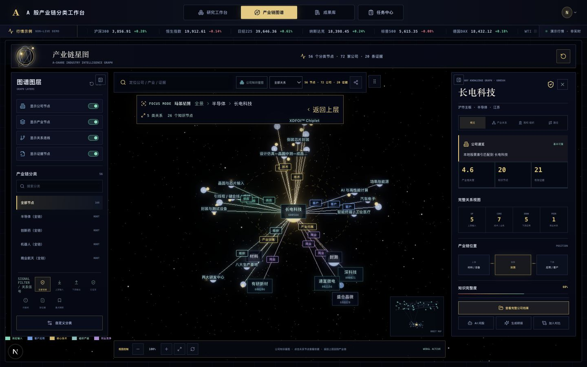
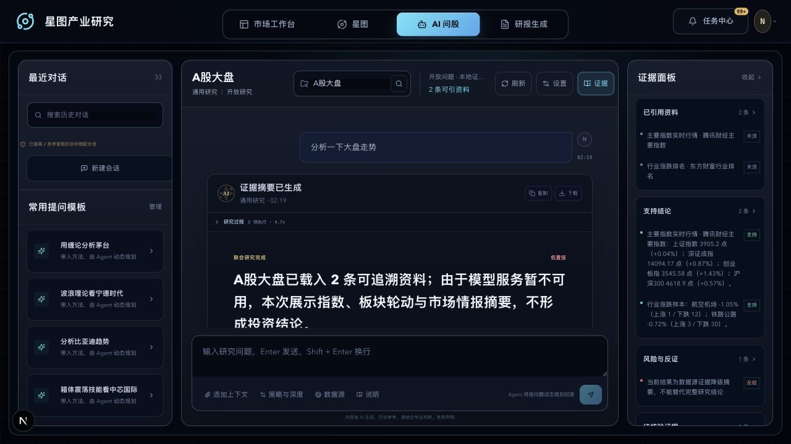
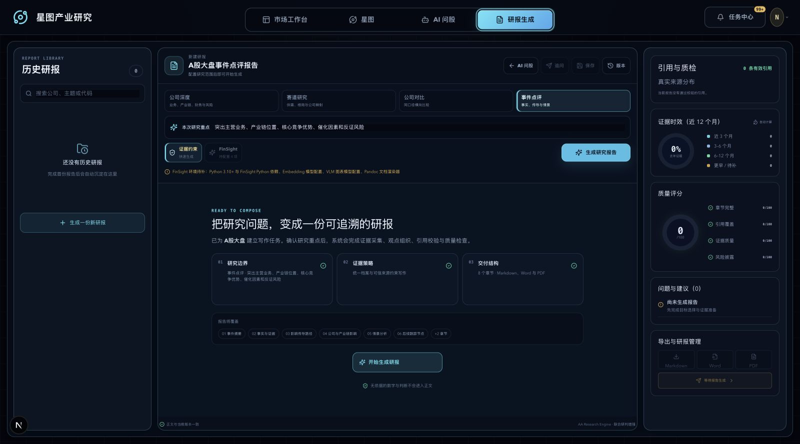
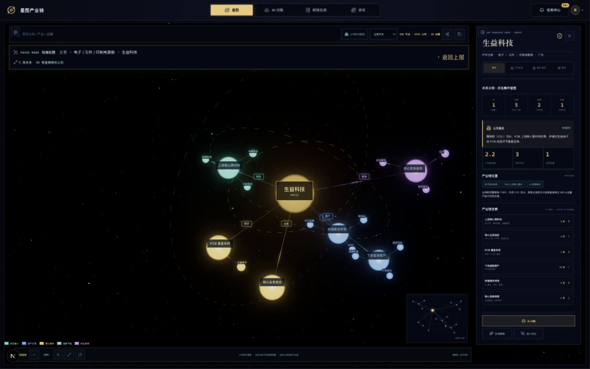
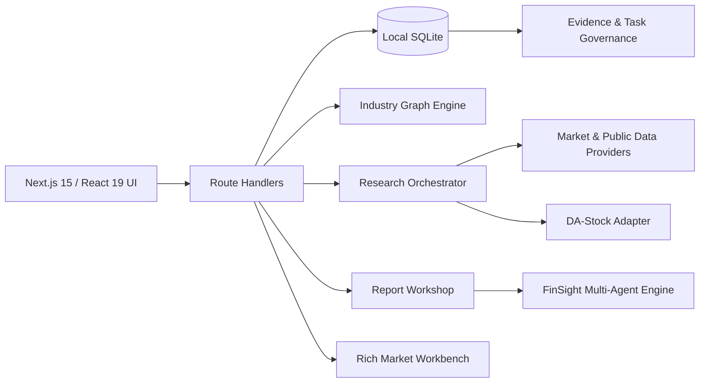

# Yidianx · 星图产业研究

> 一个本地优先、证据约束的 A 股产业链研究工作台：把市场观察、三维知识星图、多 Agent 研究、研报生成与任务治理放进同一套工作流。


## 项目概览

Yidianx 面向需要持续跟踪公司、行业和产业链关系的研究者。系统以本地 SQLite 为唯一写入源，将公司档案、上下游关系、证据、研究会话、报告版本和待办任务统一管理；没有合法引用的事实性内容不会直接进入研究结论。

核心体验由四个工作区组成：

- **市场工作台**：行情观察、新闻、技术分析与策略回测入口。
- **星图**：以 WebGL 三维图谱探索产业、公司、上下游、客户与竞争关系。
- **AI 问股**：快速、标准、深度三档研究，多角色规划、核验与反证。
- **研报生成**：公司深度、赛道研究、公司对比和事件点评，支持版本、质检与导出。

## 界面预览

### 公司知识星图



<table>
  <tr>
    <td width="50%"><strong>AI 联合研究</strong></td>
    <td width="50%"><strong>证据约束研报工坊</strong></td>
  </tr>
  <tr>
    <td></td>
    <td></td>
  </tr>
</table>

### 公司关系与产业位置



## 能力地图

| 模块 | 主要能力 |
| --- | --- |
| 数据与档案 | A 股公司检索、分类树、业务画像、证据来源、同步状态与资料时效 |
| 三维星图 | 产业全景、局部路径、公司知识图谱、关系筛选、缩略导航与深链分享 |
| AI 研究 | 问题规划、多方法并行研究、引用约束、支持/反证分栏、会话持久化 |
| 研报工坊 | 4 类报告、原生/FinSight 引擎、章节编辑、不可变版本、质量评分 |
| 交付与治理 | Markdown / DOCX / PDF 导出、任务中心、缺证据提醒、备份与恢复 |
| 市场与策略 | 行情、新闻、技术指标、DA-Stock 方法工具与本地回测桥接 |

## 系统架构



主应用负责身份边界、数据持久化和统一交互；DA-Stock、FinSight 与 Rich Workbench 以本地服务或适配器方式接入，不取代主数据库。

## 快速开始

### 环境要求

- Node.js `24.x`
- npm `10+`
- Python `3.11` 与 [uv](https://docs.astral.sh/uv/)（策略回测需要）
- macOS / Linux；Windows 建议使用 WSL2

### 1. 安装

```bash
git clone git@github.com:Liousesixteen/Stock-Classification.git
cd Stock-Classification
cp .env.example .env.local
npm install
```

### 2. 准备可选的回测环境

```bash
npm run backtest:setup
```

如果只调试 Next.js 界面，可以跳过这一步并使用 `npm run dev:next`。

### 3. 启动

```bash
npm run dev
```

打开 [http://localhost:3001](http://localhost:3001)。主命令会同时启动 Yidianx 市场服务，并把 DA-Stock 回测作为“市场工作台”中的内嵌视图提供。

首次启动默认创建空的 `data/stock-classification.sqlite`。若要加载内置的半导体、创新药、机器人、商业航天和证券样板，请在 `.env.local` 中设置：

```dotenv
STOCK_BOOTSTRAP_MODE=sample
```

样板导入是幂等的，不会覆盖已有分类、公司、关系或更新时间；真实研究环境建议保持默认值 `empty`。

## AI 与数据源配置

项目无需 API Key 也能启动。需要 AI 分类、AI 问股或完整研报能力时，再按需配置：

```dotenv
DEEPSEEK_API_KEY=
DEEPSEEK_BASE_URL=https://api.deepseek.com
DEEPSEEK_MODEL=deepseek-v4-flash
CLASSIFICATION_AGENT_PROVIDER=rules

FINSIGHT_REPORT_ENGINE=native
STOCK_PROFILE_SOURCE_PRIORITY=disabled
```

- `CLASSIFICATION_AGENT_PROVIDER=rules` 使用本地规则；设为 `deepseek` 后启用模型分类，并在失败时自动回退。
- AI 研究仅接受公司档案、图谱关系和证据目录中的合法引用 ID。
- 外部公司资料 Provider 默认关闭；确认数据授权与使用边界后再配置优先级。
- 所有真实密钥只应写入 `.env.local`，不要修改或提交任何 `.env.example`。

完整变量说明见 [.env.example](.env.example)。

## 常用命令

```bash
npm run dev                 # 完整本地工作台
npm run dev:next            # 仅启动 Next.js
npm run typecheck           # TypeScript 检查
npm run lint                # ESLint
npm test                    # Vitest 单元/组件测试
npm run build               # 生产构建
npm run test:e2e            # Playwright 端到端测试
npm run security:check      # 密钥扫描
npm run ops:check           # 运维配置检查
npm run db:backup           # 备份本地数据库
```

真实数据源验收会访问公开网络，默认不随单元测试运行：

```bash
npm run validate:providers
```

## 目录结构

```text
src/
├── app/                    # Next.js 页面、API 与全局样式
├── components/             # 星图、研究、报告、任务与市场组件
└── lib/                    # 数据库、Provider、研究编排和图谱引擎
services/
├── da-stock/               # 策略研究与回测适配
├── finsight/               # 多 Agent 研报引擎
└── rich-workbench/         # 市场工作台本地服务
scripts/                    # 启动、同步、备份和发布脚本
tests/                      # 单元、组件、集成、E2E 与安全测试
docs/                       # 架构迁移、部署、运维和版本说明
audit/                      # 视觉设计审计与界面基线
```

## 数据、安全与边界

- SQLite 数据库、备份、缓存、测试产物和本地环境变量均被 Git 忽略。
- 完全失败的资料同步采用指数退避；部分成功会保留已有结果并延迟补偿。
- 生产环境支持 Basic Auth、运维令牌、请求体限制与分类型速率限制。
- 分享研究会话需显式配置 webhook；未配置时界面会明确提示。
- 本项目用于研究工作流与工程实践，不构成任何投资建议。

## 延伸文档

- [当前版本说明](docs/releases/0.1.0-rc.2.md)
- [生产部署与发布清单](docs/operations/DEPLOYMENT.md)
- [数据库备份、验证与恢复](docs/operations/BACKUP_AND_RECOVERY.md)
- [数据源合规边界](docs/operations/DATA_SOURCE_COMPLIANCE.md)
- [FinSight 研报引擎迁移](docs/FINSIGHT_REPORT_WORKSHOP_MIGRATION.md)
- [DA-Stock AI 研究迁移](docs/DA_STOCK_AI_RESEARCH_MIGRATION.md)
- [项目实现与面试讲解](docs/实习面试项目详解.md)

## 第三方组件

仓库内迁入或适配的第三方服务保留其各自许可证与署名文件。根项目当前未单独声明开源许可证；公开复用或商业使用前，请逐项确认依赖、数据源和内置服务的授权条件。
