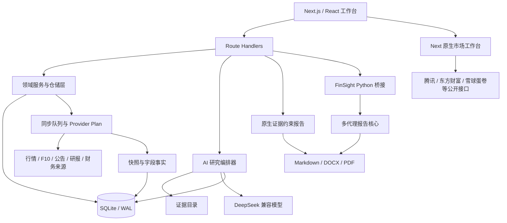

# A 股产业链智能研究工作台：实习面试项目完整讲解

> 适用版本：`feature/stock-classification-mvp`，核对提交 `b491768` 及当前工作区代码。  
> 项目名称：Stock Classification  
> 文档目标：帮助项目作者在实习面试中，从产品问题、系统设计、数据可信度、AI 研判、工程实现和局限性六个层面完整讲清项目。  
> 边界声明：本文不是原有迁移文档的改写或其他项目的功能清单，而是依据当前仓库的真实代码、数据库和测试结果，重新建立的一套本项目叙事。涉及第三方或迁入模块的部分会明确来源，并重点说明它们在本项目中的职责、接口和改造。

---

## 1. 先把项目讲成一句话

这是一个本地优先的 A 股产业链研究工作台：它把全市场公司、申万行业分类、公司与产业链的关系、可追溯证据、行情与基本面字段、AI 多角色研判、研究报告和待办任务组织在同一个 SQLite 知识底座上，目的是把“搜资料—判断归类—形成观点—验证证据—输出报告”从一组割裂工具变成一条可复查的研究闭环。

这个定义有四个关键词：

- **A 股产业链**：核心对象不是单一股票行情，而是公司、行业、上下游实体及它们之间的关系。
- **证据驱动**：系统区分“字段事实、来源快照、研究结论和原始证据”，不能把模型摘要当成原始证据。
- **研究闭环**：研究结果会继续生成补证据、验证关系、重试同步等任务，而不是停在一次聊天回答。
- **本地优先**：业务数据默认保存在本地 SQLite，敏感配置通过环境变量注入，应用可以以单机研究台的方式部署。

### 30 秒面试版

> 我做的是一个 A 股产业链智能研究工作台。它先把 5522 家 A 股公司和申万 2021 三级行业体系同步到本地 SQLite，再通过可插拔数据源补齐行情、F10、公告、研报和财务字段。系统不会把缺失值当成 0，也不会直接相信 AI 生成内容，而是为每个字段和关系记录来源、状态、置信度、验证状态与有效期。在此基础上，我做了三维产业图谱、可选择研究策略的多角色 AI 研判、带引用校验的报告生成，以及由数据缺口自动产生的任务中心。项目的重点不是“接一个大模型”，而是让研究结论可追溯、失败可降级、任务可闭环。

### 2 分钟面试版

> 这个项目解决的是个人或小团队做 A 股研究时资料分散、分类口径不一致、AI 容易幻觉、研究过程不可复现的问题。系统底层用 SQLite 建立统一研究数据模型：公司和行业分类是基础对象，公司与分类之间不是简单标签，而是一条带关系类型、方向、强度、置信度、验证状态和证据的研究关系。数据同步层通过 provider plan 管理多个外部数据源，支持缓存、超时、熔断、部分成功和重试；每个字段会以 available、missing、failed 或 skipped 的状态单独落库，所以“没有数据”不会被误解成“数值为零”。
>
> 在应用层，我做了三个关键闭环。第一个是产业图谱：把分类、公司、产业实体和证据组织成可渐进展开的三维图，并提供路径搜索和证据状态提示。第二个是 AI 研判：快速模式一次模型调用，标准和深度模式由规划、多个专业角色并行分析、主分析师汇总组成；所有具体事实必须引用证据目录中的编号，没有有效引用的陈述会被拦截或降级成证据缺口。第三个是报告与任务：报告按章节完整度、引用覆盖率、证据质量和风险披露评分；数据缺失、证据过期、低置信关系或同步失败会自动转成任务，问题消失后任务自动完成。
>
> 项目还集成了一个轻量市场工作台和 FinSight 报告引擎。我不会把外部核心说成自己从零实现；我负责的是把这些能力重构到当前领域模型里，包括 TypeScript 数据适配、进程桥接、进度协议、报告版本化、文件边界检查和统一工作流。这也是这个项目最能体现工程能力的地方：不是堆功能，而是建立清晰的事实边界和失败边界。

---

## 2. 项目要解决什么问题

### 2.1 原始研究流程的痛点

一个常见的个股研究过程通常分散在行情软件、公告网站、搜索引擎、Excel、笔记软件和大模型对话中，容易出现以下问题：

1. **分类只剩一个标签**：一家公司为什么属于某产业链、是主营还是概念、证据是什么，往往没有记录。
2. **来源之间互相覆盖**：不同接口给出不同字段时，最终只保留一个值，无法知道哪个来源成功、哪个失败。
3. **缺失值被错误解释**：接口失败、字段不存在和真实值为 0 是三种不同状态，但很多实现把它们混为一谈。
4. **AI 输出无法核查**：答案看起来完整，却不知道结论来自公告、研报、模型常识还是幻觉。
5. **研究没有后续动作**：发现证据不足后仍靠人记忆，缺少自动生成、重开和关闭任务的机制。
6. **产出不可复现**：聊天、图表和报告彼此分离，无法回到当时的数据和引用上下文。

### 2.2 本项目的产品目标

本项目不是交易下单系统，也不是高频行情终端。它的目标是建立一张“可继续工作的研究桌面”：

- 用统一分类树管理行业、主题和产业链节点；
- 用显式关系表达公司和分类之间的研究判断；
- 用字段事实和证据记录判断依据；
- 用 AI 帮助组织分析，但不允许 AI 代替证据；
- 用报告沉淀阶段性结论；
- 用任务中心追踪尚未解决的证据缺口。

### 2.3 明确不做什么

- 不提供自动交易或收益承诺；
- 不把实时行情接口包装成交易所级别的实时数据服务；
- 不默认启用存在商业授权风险的数据源；
- 不把模型回答当作财务事实；
- 不假装当前单机架构已经具备多租户、横向扩展和机构级权限体系。

---

## 3. 当前仓库到底包含什么

仓库中存在两个相关实现，面试时要主动说清，避免把边界讲混：

| 部分 | 所在位置 | 定位 | 与主项目的关系 |
|---|---|---|---|
| 主应用 | `.worktrees/stock-classification-mvp` | Next.js + SQLite 的完整产业链研究工作台 | 本文的核心对象 |
| 轻量市场工作台原型 | `services/rich-workbench` | 历史 Python 兼容实现；默认不启动 | 主应用已改为 Next 原生市场工作台，兼容服务仅在显式开启时运行 |

主应用当前入口是 `src/app/page.tsx`，渲染 `src/components/workbench/Workbench.tsx`。顶层工作区包含市场工作台、产业星图、AI 研判、研报生成和账户/运行状态入口；任务中心以抽屉形式贯穿多个工作区。

截至文档核对时，本地数据库的真实规模为：

| 数据对象 | 数量 |
|---|---:|
| A 股公司 | 5522 |
| 分类节点 | 568 |
| 其中申万 2021 节点 | 512 |
| 公司—分类关系 | 5599 |
| 字段事实 | 543 |
| 原始证据 | 23 |
| 公司研究档案 | 11 |
| 同步任务 | 12 |
| AI 研究运行记录 | 35 |
| AI 会话 | 49 |
| AI 消息 | 114 |
| 研究任务 | 173 |

这组数字体现了一个重要事实：**全市场公司与分类底座已经建立，但深度字段、证据和正式报告仍处于逐步积累阶段。** 面试时不应把“覆盖全部股票代码”说成“每家公司都已完成深度研究”。

---

## 4. 从用户操作看完整业务链路

一条典型研究链路如下：

1. 用户通过代码、名称、拼音或别名搜索公司；
2. 系统从本地股票索引解析唯一标的，歧义时不自动猜测；
3. 用户把公司加入某个分类，或由同步/分类代理提出关系建议；
4. 系统创建公司—分类关系，记录关系类型、置信度、方向、强度和判断理由；
5. 后台同步任务按 provider plan 拉取行情、F10、公告、研报、财务和概念数据；
6. 每个来源保存快照，每个字段独立保存状态、来源、置信度、验证状态和时间；
7. 规则分类器先产生确定性建议，可选模型只在约束内补充，不允许越权升级为“主营业务”；
8. 用户在星图中查看分类、公司、产业实体和证据，或者查找两个节点间的关系路径；
9. 用户在 AI 研判中选择标的、研究深度和最多三个策略；
10. 研究编排器规划角色、并行调用专业分析任务，再由主分析师基于证据汇总；
11. 引用守卫过滤没有有效证据编号的具体事实陈述；
12. 用户把研究结果生成公司、行业、宏观、对比或事件报告；
13. 报告保存为不可变版本，可导出 Markdown、DOCX 或 PDF；
14. 数据缺失、证据过期、关系低置信或报告质量不足被转成研究任务；
15. 当底层问题被修复后，自动任务会完成；问题再次出现时任务会重新打开。

这条链路可以概括成：

```text
全市场底座
   ↓
数据源快照 → 字段事实 → 公司研究档案
   ↓              ↓
公司—分类关系 ← 可追溯证据
   ↓
产业星图 / AI 研判
   ↓
带引用报告
   ↓
证据缺口与研究任务
   └──────────→ 回到同步、验证和补证据
```

---

## 5. 系统架构

### 5.1 总体结构



### 5.2 技术栈与选择理由

| 层 | 技术 | 项目中的理由 |
|---|---|---|
| Web 框架 | Next.js 15、React 19、TypeScript | 页面、API 和服务器逻辑在一个工程中，适合本地一体化工作台 |
| 数据库 | SQLite、better-sqlite3 | 单机研究数据天然适合本地事务数据库；同步 API 简单，备份恢复成本低 |
| 三维可视化 | Three.js | 支持自定义节点、边、粒子、镜头和性能降级，而不仅是静态图表 |
| 校验 | Zod | API、导入文件、模型结构化结果都需要运行时校验 |
| 文档导出 | docx、pdf-lib、fontkit | 在应用内生成可交付报告，并嵌入中文字体确保 PDF 可搜索 |
| 自动化测试 | Vitest、Playwright | 单元/集成测试覆盖领域逻辑，浏览器测试覆盖关键用户路径 |
| 外部报告引擎 | Python 3.10+、FinSight | 复用成熟的多代理采集—分析—写作流水线，由桥接层隔离运行时 |
| 轻量市场服务 | Python 标准库 HTTP 服务 | 尽量减少依赖，作为独立市场面板由主进程监督 |

### 5.3 为什么选择本地优先

本地优先不是为了回避后端设计，而是与当前使用场景匹配：

- 研究档案和观察列表具有个人敏感性；
- SQLite 可以通过事务保证分类、关系、证据和任务的一致性；
- 报告生成可能产生较大本地文件，不必先经过对象存储；
- 单机阶段更适合快速迭代领域模型。

代价也很明确：SQLite 更适合单写实例；进程内限流和指标不能跨实例共享；当前 Basic Auth 也不是多租户权限系统。如果未来变成团队协作产品，需要迁移到服务端数据库、对象存储、分布式队列和正式身份体系。

---

## 6. 数据模型：为什么不是“股票表 + 标签表”

当前数据库包含 22 张业务表，可以按职责分为七组。

### 6.1 分类与公司

- `categories`：自关联分类树，支持申万行业和用户自定义产业链；
- `companies`：股票代码为主键，保存公司名称、市场、状态和基础资料；
- `company_category_relations`：公司与分类之间的研究关系。

关系表是整个项目的核心。它不仅说明“公司属于哪个分类”，还表达：

- 关系类型：主营业务、重要相关、概念、少量布局、待验证；
- 关系方向：无向、流入、流出、双向；
- 关系强度：0—100；
- 置信度：高、中、低；
- 观察时间和验证状态；
- 判断理由、来源和是否加入重点观察。

这样设计的原因是，同一家公司与同一产业链之间可能存在不同强度和不同性质的联系。一个布尔标签无法区分“收入核心来源”和“市场概念映射”，也无法支持后续证据审计。

### 6.2 证据、快照与字段事实

- `evidences`：附着在公司—分类关系上的原始证据；
- `company_source_snapshots`：某个 provider 最近一次请求，以及最近一次成功结果；
- `company_field_facts`：拆分到字段级别的研究事实；
- `company_research_profiles`：将稳定信息组织为可读的公司研究档案；
- `research_notes`：人工研究备注。

这里有一个关键分层：

```text
来源快照：这个接口这次返回了什么？
字段事实：某个字段当前可用吗，值是什么，来自哪里？
研究档案：把多项事实组织成可读的公司画像。
关系证据：为什么认为公司和某分类存在这种关系？
AI 结论：在以上材料基础上形成的分析，不是原始证据。
```

字段事实的状态为 `available / missing / failed / skipped`。因此：

- `available + 0` 表示来源明确给出了零；
- `missing` 表示来源成功，但没有该字段；
- `failed` 表示来源调用失败，不能据此判断字段值；
- `skipped` 表示当前策略没有请求这个字段。

这是项目防止错误结论的第一道边界。

### 6.3 产业实体图谱

- `research_graph_entities`：产品/技术、客户/供应商、项目/产能、事件/政策等实体；
- `company_graph_entity_relations`：公司与产业实体的关系；
- `company_graph_entity_evidences`：实体关系对应的证据。

这组表让图谱不只显示“公司—行业”，还能表达更具体的产业链语义，例如某公司供应某种材料、服务某类客户或建设某个产能项目。

### 6.4 AI 研究

- `ai_research_runs`：一次具体研究执行；
- `ai_research_reports`：旧版/兼容研究结果记录；
- `universal_research_runs`：不限定公司目标的通用研究；
- `ai_research_sessions`：持续会话；
- `ai_research_messages`：会话消息、进度和结果元数据。

会话与运行分开，可以保留上下文，又能把每次执行的模型、模式、策略、证据和耗时独立审计。

### 6.5 报告与版本

- `research_documents`：报告当前状态和当前版本指针；
- `research_document_versions`：不可变的历史版本。

编辑、改写和恢复历史内容都创建新版本，不覆盖旧内容。这样可以回答“这份结论在什么时间、基于什么材料形成”。

### 6.6 任务闭环

- `research_tasks`：自动或人工研究任务；
- `research_artifact_states`：研究产物状态。

自动任务使用稳定 `task_key` 幂等更新：问题仍存在时更新同一任务；问题消失时自动完成；完成后问题再次出现时重新打开。

### 6.7 运行与审计

- `sync_tasks`：数据同步队列、重试次数、租约和幂等载荷；
- `operation_audit_events`：API 操作审计。

SQLite 启用 WAL、外键、`busy_timeout=5000` 和 `synchronous=NORMAL`。数据库文件权限收紧为 `0600`。表结构升级采用“存在即复用、缺列再补”的渐进迁移方式，适合本地应用滚动升级。

---

## 7. 全市场公司和申万行业底座

`scripts/sync-a-share-universe.py` 负责同步全市场基础数据，核心过程是：

1. 从本地股票索引读取 A 股证券；本地不可用时可走已配置的数据工具路径；
2. 过滤沪深北交易所中仍有效的 A 股代码段；
3. 获取申万 2021 一级、二级、三级行业目录；
4. 获取证券与申万三级行业的成员关系；
5. 创建统一的“申万 2021 行业全景”根节点；
6. 在事务中 upsert 公司和行业节点；
7. 将不再出现在最新股票池中的公司标记为非活跃；
8. 替换申万来源的旧关系，同时保留用户手工建立的关系；
9. 为自动同步关系记录来源 URL、验证状态、观察时间和较高关系强度。

当前 5522 家公司按市场分布为：深交所 2893、上交所 2314、北交所 315。分类中除申万体系外，还有半导体、创新药、机器人、商业航天、证券、PCB 等自定义研究树。

### 为什么使用“替换来源关系”而不是删除全部关系

系统只替换由申万同步产生的那一部分关系，不删除人工关系。因为“官方行业归属”和“研究者建立的产业链判断”是两个不同命名空间。如果全量重建时把人工判断也清掉，数据同步就会破坏研究成果。

### 当前需改进点

同步脚本会写入“申万三级行业”这一关系类型，而 TypeScript 领域常量当前只包含五种研究关系类型。SQLite 不会阻止该字符串写入，因此运行可用，但类型系统和数据库现实没有完全一致。合理改法是把“分类体系成员关系”与“研究语义关系”拆成两个枚举或增加明确的系统关系类型，而不是简单把新字符串塞进现有枚举。

---

## 8. 数据同步层：失败不应该污染事实

### 8.1 Provider Plan

系统把外部数据源注册成 provider plan。每个 provider 定义：

- 唯一 ID 和显示名称；
- 是否为必需来源；
- 能提供哪些字段；
- 默认可信度；
- 缓存有效期；
- 超时与启用配置。

当前可配置来源覆盖：东方财富实时行情与 F10、腾讯行情、百度关联板块、巨潮公告、东方财富研报、以及新浪利润表、资产负债表和现金流量表。默认配置不启用可能受商业授权约束的来源，避免“代码能调用”被误认为“生产环境可合法使用”。

典型缓存时间按数据变化速度区分：

- 行情：10 分钟；
- F10 和关联板块：24 小时；
- 公告：1 小时；
- 研报和财务数据：6 小时。

### 8.2 并行、超时和故障隔离

多个 provider 可以并行执行，但每个来源独立超时、独立记录状态。市场概览使用 `Promise.allSettled`，因此一个来源失败不会让其他已经成功的数据丢失。

熔断器默认连续失败 3 次后打开 60 秒，随后只允许一个半开探测请求。它解决的不是“永久修好外部接口”，而是避免已知故障来源持续占用线程和延迟。

### 8.3 快照为什么同时保存“最近尝试”和“最近成功”

假设昨天拉取成功，今天接口超时。如果只保存最近一次请求，今天的失败会覆盖昨天仍有参考价值的数据；如果只保存最近成功，又看不到来源已经故障。因此快照同时记录：

- 当前最近一次尝试的状态和时间；
- 最近一次成功的字段和时间；
- 结果的过期时间。

前端由此可以显示“当前请求失败，但仍有一份已过期/未过期的历史成功数据”，而不是在失败时突然变成空白或零。

### 8.4 同步任务队列

同步任务状态包括 `pending / running / partial / success / failed`。任务具有：

- 尝试次数和最大次数；
- 下次执行时间；
- 运行租约；
- 幂等键和幂等载荷；
- 失败 provider 列表。

后台 dispatcher 默认并发 2，每 2 秒轮询，每 20 秒扫描一次。领取任务时使用事务；过期的 running 租约会先恢复为 pending，再由新 worker 领取。普通失败按 1、2、4 秒指数退避，最多 30 秒；部分成功会保留已成功数据，只重试失败来源。第二次及以后尝试强制绕过缓存，避免重复读取同一份错误缓存。

写入前还会再次检查目标关系是否仍然存在。如果用户在同步期间删除了关系，晚到的响应不会把它重新创建。

---

## 9. 分类代理：模型不能越过确定性规则

分类不是单纯让大模型自由判断，而是两层结构。

### 9.1 本地规则层

- 分类名称或明确别名直接命中：建议为“主营业务 / 高置信”；
- 领域词与上下文信号命中：建议为“重要相关 / 中置信”；
- 没有足够信号：标为“待验证 / 低置信”。

规则结果可解释、可重复，也能在没有模型 API 时工作。

### 9.2 可选模型层

模型接收来源字段、分类上下文和本地规则建议，必须输出受约束的 JSON。规范化阶段会：

- 丢弃非法枚举和非法结构；
- 在模型失败时回退到本地规则；
- 当本地没有直接命中时，禁止模型把关系升级为“主营业务”；
- 保留原有人工字段，避免自动同步覆盖用户判断。

最重要的边界是：**代理生成的聚合说明只是研究线索，不是原始证据。** 持久化逻辑会清理类似“自动同步资料……”的合成证据，不会把 AI 摘要提升为证据记录。

---

## 10. 证据可信度与研究质量

### 10.1 有效证据规则

证据先被归为以下信任状态：

- `expired`：已过有效期；
- `rejected`：人工或规则否决；
- `conflicted`：与其他事实冲突；
- `verified`：已验证；
- `source_backed`：有可访问的 HTTP(S) 来源；
- `unverified`：没有完成验证。

系统中的图谱、AI、质量评分、导出和任务中心共享同一条“有效证据”定义：证据不能过期、冲突或被拒绝，并且必须已验证，或者至少有可追溯来源 URL。共享规则避免了一个页面认为证据有效、另一个页面又认为无效。

### 10.2 公司档案质量分

公司研究档案从三个维度评分：

```text
档案质量分 = 字段覆盖率 × 45%
           + 证据覆盖率 × 35%
           + 新鲜度 × 20%
```

评分覆盖身份、业务、产业链、财务、研究五类维度。不同字段采用不同新鲜度窗口，例如行情 1 天、公告 45 天、研报 90 天、财务数据 200 天、业务资料 365 天。`待补……` 之类占位文本不会被算作有效内容。

### 10.3 报告质量分

原生报告质量分的代码公式为：

```text
报告质量分 = 章节完整度 × 35%
           + 事实段落引用覆盖率 × 30%
           + 引用证据质量 × 20%
           + 风险与反证披露 × 15%
           - 无依据陈述惩罚
```

每条无有效引用的陈述扣 4 分，最多扣 25 分。证据可信度“高 / 中 / 低”分别按 100 / 72 / 38 参与计算。报告只有在得分至少 75 且存在有效引用时才进入 ready 状态。

这两个质量分不是为了声称“75 分以上一定正确”，而是把研究流程的可检查性量化：缺字段、缺引用、证据弱或没有风险披露都会显式降低分数并生成改进项。

---

## 11. 三维产业星图

### 11.1 图谱中的对象

图谱节点分为四类：

- 分类节点；
- 公司节点；
- 产业实体节点；
- 证据节点。

边分为分类层级、公司分类关系、公司实体关系和证据链接。节点位置不是每次随机生成，而是使用 FNV-1a 32 位稳定哈希作为种子，因此相同数据在不同刷新中保持相对稳定，用户不会因为布局乱跳而重新寻找目标。

### 11.2 渐进展开

如果一次展示 5522 家公司和数百个分类，三维场景会失去可读性。因此图谱采用渐进披露：

- 总览只展示较高层分类，并为每个根分类选择最多 8 家代表公司；
- 聚焦分类时只展开下一层和直接关联公司；
- 聚焦公司时展示所属分类、每类有限数量的同行，以及有限的产品、客户、项目和事件分支。

代表公司按置信度和证据情况排序，而不是随机抽样。

### 11.3 路径搜索

路径搜索使用有界 BFS，默认最大深度 3、最多返回 12 条。边权综合关系置信度、证据、关系类型和观察标记，用于把更可信、更有研究意义的路径排在前面。

对每条关系，界面显示多源验证、单源验证、缺少来源或等待验证，并给出下一步动作。图谱因此不只是“好看的网络”，也是证据导航器。

### 11.4 性能与无障碍降级

系统根据 `prefers-reduced-motion`、CPU 核心数和设备内存选择 reduced、balanced 或 full 质量：

- reduced：关闭粒子效果、减少标签、DPR 1；
- balanced：保留少量粒子、约 60 个标签、DPR 1.35；
- full：更多粒子、约 120 个标签、DPR 1.75。

WebGL 不可用时回退为二维视图；页面不可见时降低动画工作；对减少动态效果的系统偏好予以尊重。

---

## 12. AI 研判：不是一次 Prompt，而是一条受约束的执行链

### 12.1 研究对象和会话

研究对象可以是公司、行业或开放问题，也可以选择跨市场信息。会话、消息和每次运行都会持久化。后续追问会继承上一轮的目标和已选策略，但用户的新指令优先。

为避免上下文无限增长，系统保留最近 3 轮较完整内容，并把更早历史压缩成有长度上限的摘要。

### 12.2 三种执行模式

| 模式 | 执行方式 | 最大模型调用 | 适用场景 |
|---|---|---:|---|
| 快速 | 一次协调调用 | 1 | 简短问题、快速解释 |
| 标准 | 规划 + 最多 5 个专业任务并行 + 主分析师 | 7 | 常规个股或行业研究 |
| 深度 | 规划 + 最多 7 个专业任务并行 + 主分析师 | 9 | 多维度、强反证要求的复杂研究 |

专业任务可按领域、方法、验证或反证划分。用户显式选择的研究方法被视为执行合同：如果规划器遗漏，规范化逻辑会重新插入。除一般知识问题外，标准和深度模式至少包含验证或反证视角。

### 12.3 15 种研究策略

用户最多同时选择 3 种策略：

1. 多头趋势
2. 缠论
3. 波浪理论
4. 箱体震荡
5. 情绪周期
6. 成长质量
7. 事件驱动
8. 预期重估
9. 热点题材
10. 均线金叉
11. 放量突破
12. 缩量回踩
13. 底部放量
14. 一阳夹三阴
15. 龙头策略

策略选择会影响数据需求和分析任务，不只是把策略名称拼到提示词中。例如包含技术和趋势关键词时才加载更重的技术快照，减少无关数据和调用成本。

### 12.4 证据目录和引用别名

研究开始前，系统将公司档案、字段事实、公告、研报、财务数据和图谱证据统一成证据目录。不同专业角色只接收与任务关键词相关的证据子集，以控制上下文长度。

内部证据 ID 在送入模型前映射为 `SRC1`、`SRC2` 等短别名，模型返回后再映射回真实 ID。这个设计同时解决：

- 长 ID 占用上下文；
- 模型抄错复杂标识；
- 最终结果仍能回到数据库原始证据。

### 12.5 幻觉控制和降级

系统使用多层保护：

1. 模型只能引用证据目录中的允许 ID；
2. 专业角色返回 JSON，结构非法时尝试修复；
3. 单个角色持续失败时隔离该角色，其他结果继续；
4. 主分析师输出没有引用的具体事实会被过滤；
5. 无证据时明确输出资料缺口，不能编造结论；
6. 更广泛的模型或网络故障时，退化为纯证据摘要；
7. 同一会话只允许一个运行，用户可取消；晚到响应不会覆盖新状态。

需要注意：系统允许模型回答稳定的一般金融知识，但涉及特定公司、具体日期、财务数字、事件或市场状态时必须引用项目证据。

### 12.6 进度输出

研究流通过 SSE/NDJSON 风格事件持续返回规划、数据加载、专业角色、汇总和完成状态。这样前端能展示真实阶段，而不是用假的进度条等待一个长请求。

---

## 13. 研报工作坊：双引擎与版本化

### 13.1 报告类型

系统支持公司、行业、宏观、对比、事件和通用报告。用户可以显式选择，也可以由问题关键词推断。

### 13.2 原生报告引擎

原生引擎直接读取本地字段事实、最新 AI 研究和证据目录，按报告类型建立章节大纲。模型返回结构化观点和引用，系统只接纳通过引用校验的陈述，然后计算报告质量分并生成可视化数据。

图表只从结构化业务构成等事实生成，不从自由文本中猜数字。

### 13.3 FinSight 引擎

FinSight 通过独立 Python 子进程运行：

```text
Next.js API
  → TypeScript runtime adapter
  → report_workshop_bridge.py
  → FinSight DataCollector
  → DataAnalyzer
  → ReportGenerator
  → 产物与进度事件
```

采集、分析、写作三个优先级按顺序执行，同一优先级内受信号量限制并行。运行前会检查 Python 版本、依赖、主模型、embedding、图表场景需要的 VLM、输入文件和 Pandoc。

选择 FinSight 后如果运行环境不完整，系统明确报错，不静默切回原生引擎。因为静默回退会让用户误以为报告使用了所选方法。

### 13.4 桥接层做了什么

TypeScript 侧的本项目适配负责：

- 把报告类型、研究问题和本地材料转换成 FinSight 输入；
- 只通过请求 JSON 传业务参数，不把 API Key 写入文件；
- 用 `@@FINSIGHT_EVENT@@` 前缀从普通 Python 日志中识别结构化进度；
- 支持取消并终止子进程；
- 为每次运行建立独立目录；
- 检查返回产物的路径和 `realpath`，防止路径穿越和符号链接逃逸；
- 将 FinSight 引用统一映射为项目内部引用格式；
- 把产物写入统一报告版本模型。

### 13.5 版本和导出

报告首次生成版本 1。每次编辑、AI 改写或恢复历史版本都会创建新版本，不覆盖旧版本。修改内容后，旧导出文件会失效，避免“数据库文字已变、下载文件还是旧版”。

原生导出支持：

- Markdown；
- DOCX：标题、层级、表格和页脚；
- PDF：嵌入 Noto Sans SC，中文可搜索，并带页码。

FinSight 报告优先返回其原生产物；如果产物不存在，才使用项目导出器重建。

---

## 14. 研究任务中心：让“资料不足”成为可执行动作

任务引擎会扫描并生成以下自动任务：

- 关键字段缺失或过期；
- 公司—分类关系置信度低；
- 关系缺少有效证据；
- 公司研究档案不完整；
- provider 同步失败或部分失败；
- 报告分数不足或引用不足。

任务不是一次性日志。系统根据稳定键同步状态：

```text
发现问题 → 创建/更新任务
问题仍在 → 保持打开并刷新上下文
问题消失 → 自动完成
问题复发 → 重新打开
```

普通低置信关系不能通过点击“完成”掩盖问题；完成动作会要求底层状态已修复。对低置信关系执行明确验证时，系统会把关系验证状态更新为 verified，这才构成真正完成。

重点观察关系在队列中额外加 20 优先级，使任务顺序符合研究者关注度。

---

## 15. Yidianx 市场工作台

市场工作台现在是主 Next 应用中的原生工作区：`RichWorkbenchWorkspace` 直接调用 `/api/market-workbench`，由统一的 TypeScript 数据提供器取得腾讯财经和东方财富数据，并在同一证据边界内呈现。原 `services/rich-workbench` Python 实现作为兼容参考保留，只有设置 `ENABLE_RICH_WORKBENCH_LEGACY=true` 时才会由启动脚本拉起，默认不占用额外端口。

它提供：

- 市场指数与实时概览；
- 资金流；
- 观察列表实时行情；
- K 线、分时、RSI 与融资数据；
- 新闻、美股市场参考；
- 本地观察列表管理。

它有几条值得讲的业务规则：

- 缺失数据保持 unavailable，不填 0；
- 分钟资金流是累计快照，只取最新累计值，不能把每分钟累计值再次求和；
- “牛市顶部”评分由估值、技术、市场宽度和波动等可用维度组成；可用权重低于 70% 或有效维度少于 4 时拒绝发布分数；
- 私有持仓不通过公共 API 对外暴露；
- 非 loopback 访问必须配置 Basic Auth。

这个模块的定位是“市场环境上下文”，不是主项目事实库的替代品。产业链研究结论仍以主应用 SQLite 中的字段事实和证据为准。

---

## 16. 导入、导出与数据可迁移性

### 16.1 Excel 导入

系统读取工作簿第一张表，先 preview 再 commit。预览阶段检查：

- 中文列头；
- 6 位 A 股代码格式；
- 分类路径是否合法；
- 关系类型、置信度和证据来源类型是否合法；
- 文件内是否存在重复记录；
- 分类是否存在。

分类名称本身可能包含 `/`，因此路径解析不是简单 `split('/')`，而是使用动态规划匹配已有分类树。默认文件上限 10 MB、最多 5000 行。

提交阶段再次用 Zod 校验，并在事务中 upsert 公司、关系、证据和备注，避免预览后请求被篡改或只写入一半。

### 16.2 工作区导出

JSON 工作区格式当前为 version 4，覆盖分类、公司、关系、证据、档案、图谱实体、AI 会话、报告、任务和审计等数据。CSV 关系矩阵会输出有效证据数量，并对以 `= + - @` 开头的单元格加前缀，降低表格公式注入风险。

---

## 17. API 设计概览

API 按领域划分，而不是把所有动作放进一个通用接口：

| 领域 | 代表路由 | 主要职责 |
|---|---|---|
| 公司与分类 | `/api/companies/[code]`、`/api/categories`、`/api/relations` | 公司档案、分类树、关系与证据维护 |
| 数据同步 | `/api/companies/[code]/sync`、`/api/sync-tasks` | 创建、查询和恢复同步任务 |
| AI 研究 | `/api/ai/research`、`/api/ai/research/stream`、`/api/ai/research/sessions` | 研究执行、流式进度、会话和取消 |
| 研究配置 | `/api/ai/research/models`、`providers`、`strategies`、`tools` | 向前端暴露真实可用能力 |
| 报告 | `/api/ai/reports`、`/api/ai/reports/export`、`/api/ai/reports/engine` | 生成、版本、导出、引擎状态 |
| 图谱与质量 | `/api/industry-graph`、`/api/quality` | 图数据、质量指标和路径上下文 |
| 任务与看板 | `/api/research-queue`、`/api/research-dashboard`、`/api/research-results` | 研究任务闭环和结果状态 |
| 数据交换 | `/api/import/preview`、`commit`、`/api/export` | Excel 预检/提交和工作区导出 |
| 运行运维 | `/api/health`、`/api/metrics`、`/api/runtime-config` | 健康、指标和非敏感运行配置 |

所有写入接口都应由运行时校验保护；长任务通过任务记录或流式事件返回，而不是让普通请求无限阻塞。

---

## 18. 安全与运维

### 18.1 请求边界

中间件提供：

- 可选 Basic Auth；用户名和密码必须同时配置，否则返回 503，避免半配置状态；
- 进程内固定窗口限流：AI、写请求和读请求使用不同额度；
- 普通 API 和导入 API 使用不同请求体上限；
- CSP、frame、referrer 和 permissions 等安全响应头；
- request ID 贯穿请求和审计。

审计记录会递归遮盖 key、secret、token、password、authorization、cookie 等敏感字段，不保存完整请求体。

### 18.2 数据库备份恢复

备份使用 SQLite 在线备份能力，完成后执行 `quick_check` 并计算 SHA-256。恢复前先验证候选数据库，再自动创建恢复前备份，最后原子替换数据库并清理旧 WAL/SHM 文件。

发布检查会拒绝把数据库、WAL 或备份文件打进 standalone 构建，避免把研究数据随应用镜像泄露。

### 18.3 当前安全边界

当前适合受控单机或小范围内网使用，不等同于互联网多用户 SaaS：

- Basic Auth 没有用户级角色和资源权限；
- 限流与指标在进程内，重启后重置，也不能跨实例；
- SQLite 适合单主写入；
- 外部数据源和模型密钥仍需部署者自行管理授权与额度。

---

## 19. 迁入与借鉴内容如何真正成为本项目能力

这一节最重要的原则是：**把外部来源说清楚，把自己的工程贡献说具体。** “变成自己的东西”不等于抹掉来源，而是理解它、重构接口、建立领域约束，并能解释为什么这样设计。

### 19.1 DA-Stock：参考能力边界，核心链路用 TypeScript 重建

项目曾系统梳理 DA-Stock 的数据源、研究策略和研究工具，但当前主链路不是把另一个项目直接嵌进页面。实际处理是：

- 在 TypeScript 中重新定义 provider plan、字段事实、来源快照和同步队列；
- 把研究策略整理为本项目的 15 个可选策略，并限制最多选择 3 个；
- 把研究工具的“可用性”显式返回给前端，不制造模拟成功；
- 用本项目的 SQLite 关系、证据、会话和任务模型承接结果；
- 对跨市场或额外搜索能力保留可选 CLI bridge，而不是让核心 Web 请求强依赖另一个仓库。

面试时可这样表述：

> 我先审计了已有数据工具的能力边界，但没有把其内部对象直接搬进 Web 应用。我重新以“来源快照—字段事实—证据目录—研究会话”为边界实现 TypeScript 服务，使数据质量状态、缓存、熔断和 AI 引用都能进入同一个领域模型。外部 CLI 只作为可选 provider，因此不存在它失效就拖垮整个主链路的问题。

当前仍有一个可移植性债务：全市场同步脚本的回退路径会探测开发机上的 DA-Stock 目录。正式交付应把股票索引作为项目资源或通过明确配置注入，彻底消除个人绝对路径。

### 19.2 FinSight：保留 GPL 核心，原创贡献在产品化集成层

`services/finsight` 保留了 FinSight 上游的多代理报告核心，许可证为 GPL-3.0。采集代理、分析代理、报告代理及其通用执行框架不能描述成“我从零发明”。

本项目完成的工作是：

- 定义 Next.js 与 Python 之间的请求和进度协议；
- 将本地公司/行业研究材料转换成报告任务；
- 建立运行前能力检查和明确错误提示；
- 隔离 API Key 和运行目录；
- 实现取消、超时、子进程终止和日志分流；
- 校验产物真实路径，阻止目录逃逸；
- 将引用、报告状态、不可变版本和导出入口接入本项目数据库与 UI；
- 与原生证据约束引擎并列，让用户明确选择并看到实际使用的引擎。

面试时可这样表述：

> FinSight 是我集成的开源 GPL 报告核心，不是我从零实现的代理框架。我的工作重点是把一个独立 Python 研究框架变成当前产品中可控、可观测、可取消、可版本化的报告引擎，并且补上输入、密钥和产物路径边界。这个过程让我处理了跨语言进程协议、运行时探测、错误隔离和领域模型适配，而不是只调用一个脚本。

### 19.3 Galaxy View：使用 MIT 可视化模块，图谱语义和数据管线属于本项目

`src/lib/vendor/galaxy-view` 中的部分可视化基础模块改编自 MIT 许可的 galaxy-view。第三方通知已经保留来源和许可。本项目自己负责的是：

- 将分类、公司、实体和证据映射成领域图；
- 设计总览、分类聚焦、公司聚焦的渐进披露；
- 设计关系权重、验证状态和路径搜索；
- 生成稳定位置和设备质量降级；
- 将图谱点击行为接入研究、报告和任务工作流。

面试中不要说“我从零写了整个三维渲染引擎”，应说“我基于许可模块完成了产业图谱的数据建模、布局策略、交互与产品集成”。

### 19.4 Yidianx 市场服务：独立市场模块的统一接入

市场工作台与主项目共享 Next 启动生命周期和原生数据提供器。`/api/market-workbench` 对指数、市场宽度、行业、快讯和可选个股资金流执行并行取数，按 provider 返回可用/失败/未查询状态；UI 对部分失败保持可见，不用演示值覆盖真实边界。原 Python 服务仅用于兼容回滚，不参与默认路由。

### 19.5 一张表总结“来源”和“自己的贡献”

| 能力 | 来源事实 | 本项目可真实主张的工作 |
|---|---|---|
| 数据与策略参考 | 审计 DA-Stock 行为 | TypeScript provider、字段事实、快照、同步队列、证据目录和 UI 能力状态 |
| 多代理长报告 | FinSight GPL-3.0 核心 | 跨语言桥接、运行探测、进度、取消、安全目录、版本和双引擎产品流 |
| 三维基础模块 | galaxy-view MIT 改编 | A 股产业图数据模型、渐进布局、路径、证据语义和性能降级 |
| 中文 PDF 字体 | Noto Sans SC / OFL | 嵌入、分页和可搜索中文 PDF 导出 |
| 市场面板 | 同仓库 Python 模块 | 主进程监督、rewrite/iframe 接入、与主事实库的边界设计 |

---

## 20. 最值得讲的工程难点

### 难点一：如何表示“不知道”

最容易被忽略的问题不是模型，而是数据状态。接口失败、字段不存在、未请求和真实为零完全不同。本项目通过字段级状态、来源快照和最近成功记录，把“不知道”变成一等数据。这样质量评分、AI 和 UI 都不会把空值当零。

### 难点二：如何防止同步覆盖人工研究

全量行业同步只替换系统来源关系；公司字段写入优先保留已有人工内容；同步完成前再次检查关系是否已被用户删除。这些规则共同避免自动化任务破坏人的研究成果。

### 难点三：如何让 AI 输出可核查

系统不是在 Prompt 里简单写一句“请勿幻觉”，而是建立证据目录、允许引用集合、短别名映射、角色证据路由、结构校验、无引用过滤和质量扣分。控制点位于模型调用前、调用中和调用后。

### 难点四：如何隔离不稳定外部系统

数据 provider 通过超时、缓存、熔断和 `allSettled` 隔离；同步通过任务和租约隔离；FinSight 通过子进程和桥接协议隔离；模型失败通过证据摘要降级。每一层都定义“局部失败后还能保留什么”。

### 难点五：如何让大图谱既稳定又可读

全量渲染会产生视觉噪声和性能问题。项目采用稳定哈希布局、分层聚焦、代表公司筛选、有界路径搜索和设备质量档位，优先保证用户能定位、理解和复查，而不是追求一次显示所有节点。

### 难点六：如何把发现的问题带回工作流

质量分如果只显示一个红色数字，没有产品价值。项目把低质量原因转成稳定、可重开的任务，并把完成条件绑定到底层事实状态，形成数据同步—研究—报告—补证据的闭环。

---

## 21. 测试与当前验证状态

文档编写时执行了以下验证：

| 检查 | 结果 | 说明 |
|---|---|---|
| TypeScript 类型检查 | 通过 | `npm run typecheck` |
| Vitest | 75 个文件通过、2 个跳过；268 项通过、2 项跳过 | 跳过项为需要真实 DeepSeek/外部 provider 的 live 测试 |
| 定向 ESLint：`src tests scripts` | 0 error、2 warning | 一个未使用组件参数、一个测试变量 |
| 全仓 ESLint | 未通过 | `eslint .` 扫描了 `services/finsight/.venv`，产生大量第三方 JS 规则错误；需补 ignore |
| Yidianx 市场服务 unittest | 33 项完成，HTTP 测试类未启动 | 当前沙箱禁止绑定本地端口，报 `PermissionError`，不是业务断言失败 |
| FinSight pytest | 收集 109 项后被 2 个 collection error 阻断 | 一个测试引用已移除的 `CodeExecutor`，一个测试在导入阶段强制要求 VLM Key |

结论应如实表达为：**主 TypeScript 领域链路的静态检查和单元/集成测试通过；外部引擎的测试收口、全仓 lint 忽略规则和依赖真实网络/密钥的端到端验证仍需完善。**

---

## 22. 当前局限与技术债务

按优先级排序：

### P0：交付前必须处理

1. **统一关系类型**：申万同步关系类型与 TypeScript 枚举不一致；
2. **修复全仓 lint 边界**：忽略 `services/**/.venv`、浏览器缓存和生成目录；
3. **收口 FinSight 测试**：更新过时导出引用，把需要密钥的测试改成显式 integration marker；
4. **完成真实报告验收**：当前数据库正式报告数量为 0，需要至少用原生引擎完成一套带引用、版本和三格式导出的验收样本。

### P1：提高可移植性与稳定性

5. 移除同步脚本中的个人绝对路径回退；
6. 对 provider 字段冲突建立更完整的多源仲裁策略；
7. 给长任务增加更强的崩溃恢复和持久化心跳；
8. 拆分体量较大的组件和样式文件，降低 UI 维护成本；
9. 增加从公司搜索到报告导出的浏览器端到端测试。

### P2：从单机走向团队产品

10. 正式用户、角色和资源权限；
11. PostgreSQL、对象存储和分布式任务队列；
12. 跨实例限流、指标和链路追踪；
13. 数据源授权台账、成本预算和调用配额；
14. 研究结论的多人复核与审批状态。

---

## 23. 面试现场演示建议（6—8 分钟）

### 第 1 分钟：定位与数据底座

先讲一句话定位，再展示公司数量、申万分类树和自定义产业链。强调全市场底座不等于全市场深度资料完备。

### 第 2 分钟：关系和证据

打开一家公司，展示它与分类的关系类型、置信度、理由和证据。指出“主营、相关、概念”不是一个标签等级，而是不同研究语义。

### 第 3 分钟：产业星图

从行业总览聚焦到分类，再聚焦公司；查看上下游/同行分支和证据状态；演示一条有界路径。重点解释渐进披露和稳定布局，而不是只展示动画。

### 第 4—5 分钟：AI 研判

选择一个标的和 1—2 种策略，使用标准模式。展示规划、专业角色并行和主分析师汇总的进度；点开引用说明具体结论如何回到来源。如果数据不足，主动展示“资料缺口”也是正确结果。

### 第 6 分钟：报告

把刚才结果生成原生报告，展示质量分的四个组成和被拦截的无依据陈述；再展示版本历史和一种导出格式。

### 第 7 分钟：任务闭环

展示缺证据任务如何产生，补充或验证后如何自动完成。用这一步收束“项目不是聊天壳，而是研究闭环”。

### 第 8 分钟：诚实说明边界

用半分钟说明 FinSight 和 galaxy-view 的来源，以及自己的适配工作；最后讲一项明确技术债务和解决计划。主动说明边界通常比模糊宣称更能体现工程成熟度。

---

## 24. 高频面试问题与回答

### Q1：这个项目和普通股票信息网站有什么区别？

普通网站主要展示行情和标准化资料；本项目把“公司为什么属于某产业链、依据是什么、结论还缺什么”建模成关系和证据，并让 AI、报告、图谱和任务共享这套事实底座。

### Q2：为什么不用一个大模型直接联网回答？

直接回答难以复现，也无法区分来源失败和真实事实。这里先把数据变成可追溯证据目录，再让模型在允许引用集合中分析；模型故障时仍可返回证据摘要，底层资料不会跟着失效。

### Q3：你怎么控制 AI 幻觉？

控制分五层：字段事实有状态；只把有效证据放入目录；按角色路由证据；模型输出结构化引用；最终过滤无有效引用的具体陈述并在质量分中扣分。没有证据时输出缺口，不补全数字。

### Q4：为什么同时有快照和字段事实？

快照回答“某来源这次发生了什么”，字段事实回答“某字段当前是什么状态”。一份响应可能包含多个字段，多个来源也可能提供同一字段；两者分离才能保留来源运行状态并进行字段级选择和冲突处理。

### Q5：数据源挂了怎么办？

单个来源有超时、缓存和熔断；并行请求用 settled 语义保留成功结果；最近尝试和最近成功分别保存；同步任务可以部分成功并只重试失败来源。因此局部失败不会把整家公司资料清空。

### Q6：为什么用 SQLite？

当前是本地优先单人研究工作台，SQLite 事务、备份、迁移和部署成本都更匹配。代价是多实例写入和团队权限能力有限；如果进入多人协作，我会迁移到 PostgreSQL、对象存储和任务队列。

### Q7：关系为什么需要方向和强度？

产业链关系不是平面标签。方向能表示供应、客户或上下游流向，强度能区分核心与边缘联系，置信度和验证状态则表示我们对这条判断有多确定。它们服务于图谱路径、排序、风险提示和任务生成。

### Q8：图谱为什么不展示所有公司？

一次展示 5522 家公司既影响性能，也无法阅读。总览只显示高层分类和代表公司，聚焦后再按层级展开；这是信息架构选择，不是数据缺失。

### Q9：AI 多角色会不会只是多花 Token？

所以系统有三种模式。快速问题只调用一次；标准和深度模式才规划多个角色，并设置 7/9 次硬上限。角色接收相关证据子集，用户策略影响任务设计；单角色失败可隔离。是否值得使用多角色取决于问题复杂度。

### Q10：报告分数能代表投资结论正确吗？

不能。它衡量的是报告是否完整、是否有引用、证据质量如何、是否披露风险，以及是否出现无依据陈述。它是过程质量指标，不是收益率预测。

### Q11：如何处理两个来源冲突？

目前字段事实已经能标记 conflicted，证据有效性规则也会排除冲突项。下一步需要把多源仲裁从“状态表达”升级为完整策略，例如按来源权威性、发布日期、财报周期和人工复核共同决定主事实。

### Q12：同步任务如何避免被多个 worker 重复处理？

领取操作在事务中执行，并写入租约；运行任务租约过期后才会被恢复。任务还有幂等键，写入前检查关系是否仍存在。单机阶段足够，分布式阶段应改为数据库行锁或正式队列。

### Q13：FinSight 是你写的吗？

不是。它是 GPL-3.0 的开源报告核心。我负责把它接入本项目，包括跨语言协议、运行环境探测、进度、取消、输入与密钥边界、产物路径安全、引用映射、报告版本和双引擎 UI。

### Q14：三维渲染全部是你写的吗？

基础模块包含对 MIT galaxy-view 的改编。我负责本项目的产业图数据模型、渐进布局、关系语义、路径搜索、设备降级以及和研究流程的集成。来源在第三方通知中保留。

### Q15：DA-Stock 在项目里扮演什么角色？

它主要作为能力审计和可选数据桥接来源。主 Web 链路的 provider、字段事实、快照、队列、策略和会话都在当前 TypeScript/SQLite 架构中重建，因此核心体验不要求另一个仓库常驻运行。

### Q16：你认为项目目前最大的风险是什么？

不是界面，而是“数据覆盖范围”和“证据覆盖范围”容易被混淆。公司代码覆盖已经完整，但深度字段和证据仍较少。产品上需要更醒目地区分覆盖率；工程上需要真实报告验收、provider 授权与多源冲突处理。

### Q17：你最满意的设计是什么？

把 missing、failed、skipped 和真实零区分开，并让同一证据有效性规则贯穿图谱、AI、报告、质量分和任务中心。这让多个功能不是拼接页面，而是在同一事实模型上协作。

### Q18：如果再做一周，你先做什么？

先统一申万系统关系类型，修复 lint/FinSight 测试边界，完成一条真实公司从同步、研判到三格式报告的端到端验收。它们比继续加页面更直接提升可信度和可交付性。

---

## 25. 简历写法（按实际承担程度选择）

不要把下面所有句子都堆在简历上，选择 3—4 条并确保自己能展开代码细节。

- 设计并实现本地优先的 A 股产业链研究工作台，以 Next.js、TypeScript 和 SQLite 统一管理 5522 家公司、568 个分类节点及带置信度/证据的公司—产业关系。
- 构建可插拔数据同步层，通过字段级 `available/missing/failed/skipped` 状态、来源快照、缓存、熔断、租约和部分重试，避免外部接口失败污染研究事实。
- 实现证据约束的 AI 研究编排：支持快速/标准/深度模式、最多 3 种策略、多角色并行、引用别名映射、无引用陈述拦截和模型故障降级。
- 构建产业星图，将分类、公司、产业实体和证据映射为渐进展开的三维关系图，提供稳定布局、有界路径搜索、验证状态和设备性能降级。
- 设计报告质量与研究任务闭环，以章节、引用、证据和风险披露评分，并将字段缺失、证据过期和低置信关系自动转为可重开的研究任务。
- 将 GPL FinSight 报告核心产品化接入现有系统，完成 TypeScript/Python 进程协议、运行探测、进度与取消、产物路径校验、引用归一和不可变报告版本。

---

## 26. 代码阅读索引

如果面试官追问实现，可按下面顺序打开代码：

| 主题 | 主要位置 |
|---|---|
| 页面入口与工作区 | `src/app/page.tsx`、`src/components/workbench/Workbench.tsx` |
| 数据库与表结构 | `src/lib/db/schema.ts`、`src/lib/db/database.ts` |
| 领域常量 | `src/lib/domain/*` |
| 公司与分类仓储 | `src/lib/repositories/*` |
| 全市场同步 | `scripts/sync-a-share-universe.py`、`scripts/run-a-share-sync.mjs` |
| Provider 与公司同步 | `src/lib/datasources/*`、`src/lib/research/companyProfileSync.ts`、`src/lib/research/syncTask*.ts` |
| 分类代理 | `src/lib/agents/*classif*`、`src/app/api/agents/classify` |
| AI 研究执行 | `src/lib/research/executeResearch.ts`、`researchPlanning.ts` |
| 多角色与报告质量 | `src/lib/agents/deepseekResearchAgent.ts` |
| 策略目录 | `src/lib/agents/researchSkills.ts` |
| 证据目录 | `src/lib/research/researchEvidenceCatalog.ts` |
| 图谱构建 | `src/lib/industry-graph/*`、`src/components/atlas/*` |
| 报告仓储与导出 | `src/lib/repositories/researchDocuments.ts`、`src/lib/export/researchDocument.ts` |
| FinSight 桥接 | `src/lib/finsight/runtime.ts`、`services/finsight/integration/report_workshop_bridge.py` |
| 自动任务 | `src/lib/repositories/researchTasks.ts`、`src/lib/quality/checks.ts` |
| 市场工作台 | `src/app/api/market-workbench/route.ts`、`src/components/workbench/RichWorkbenchWorkspace.tsx`、`src/lib/datasources/daStockNativeResearchProvider.ts` |
| 中间件与审计 | `src/middleware.ts`、`src/lib/operations/*` |
| 导入导出 | `src/lib/import/*`、`src/lib/export/*`、`src/app/api/import/*`、`src/app/api/export` |
| 第三方来源 | `THIRD_PARTY_NOTICES.md`、`services/finsight/LICENSE` |

---

## 27. 最后应形成的项目认知

这个项目最准确的定位，不是“一个能看股票的 3D 网站”，也不是“套了大模型的金融问答”。它真正的主线是：

1. 用领域模型表示公司、分类、产业实体和研究关系；
2. 用来源快照和字段事实守住数据状态；
3. 用证据有效性规则约束图谱、AI 和报告；
4. 用版本和审计保存研究过程；
5. 用任务中心把证据缺口带回下一轮工作。

面试时最有说服力的不是功能数量，而是能准确回答三个问题：

- **这条结论来自哪里？**
- **如果来源或模型失败，系统会怎么表现？**
- **发现证据不足后，下一步由谁、在什么地方完成？**

只要始终围绕这三点展开，这个项目就会从“功能集合”变成一套完整、可信、可继续演进的研究系统。
